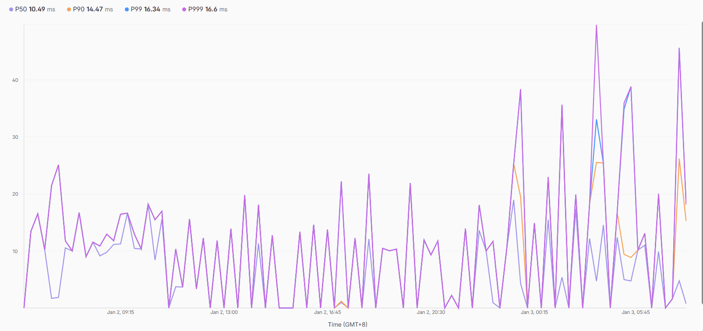

# Kotlin cloudflare worker

A library to running kotlin/js on cloudflare worker.

<div style="display: block">
<a href="README.md">English</a>
<a href="README-zh.md">中文</a>
</div>

# Get started

## Setup

> `kotlinx.coroutines` is required

```kotlin
plugins {
    kotlin("multiplatform") version "2.2.21"
}

repositories {
    mavenCentral()
    maven("https://repo.maven.rtast.cn/releases")
}
```

```kotlin
// to get latest version of this lib, go to 
// https://next.pkg.rtast.cn/#/releases/cn/rtast/kotlin-cfworker/core/
implementation("cn.rtast.kotlin-cfworker:core:1.0.2")
```

## Run app

```kotlin
kotlin {
    js(IR) {
        nodejs {
            outputModuleName = "kotlin-cloudflare-worker"
            binaries.executable()
        }
    }
}
```

> Minimal hello world app

```kotlin
/**
 * DO NOT EDIT THIS FUNCTION
 */
fun main() {
    @Suppress("unused_expression")
    val eventListener = EventListener { event ->
        val dyn = event.asDynamic()
        event.asDynamic().respondWith(handleRequest(dyn.request as Request))
        Unit
    }
    js("addEventListener('fetch', eventListener)")
}

@JsExport
fun handleRequest(request: Request): Promise<Response> = GlobalScope.promise {
    val server = WorkerApplication().apply {
        route("/") {
            respondText("Hello kotlin cloudflare worker")
        }
    }
    return@promise server.handle(request)
}

```

> Before run worker locally, you need to install wrangler and login

First, create `wrangler.toml` in your root project and configure it

```toml
name = "kotlin-cloudflare-worker"  # any name you want
account_id = "<your account id>"
workers_dev = false
preview_urls = false
compatibility_date = "2022-08-11"
main = "kotlin-cloudflare-worker.js"  # Set this value same as `outputModuleName`
```

Then run gradle task `gradlew compileProductionExecutableKotlinJs`,
copy wrangler.toml into `build/compileSync/js/main/productionExecutable/kotlin`,
and run `wrangler dev` command in `build/compileSync/js/main/productionExecutable/kotlin`,

## Deploy

Run gradle task, copy wrangler.toml, but use `wrangler deploy` to deploy to cloudflare worker

# Note

JavaScript uses a single-threaded execution model. All asynchronous work is ultimately driven by the event loop (
including Kotlin coroutines on JS).

Therefore, DO NOT create a CoroutineScope(Dispatchers.Default) or launch CPU-bound coroutines, as there is no real
background thread on JS targets.

All coroutines run on same event loop thread, and all coroutines not in same event loop will be dropped.

Example:

```kotlin
// DO NOT DO THIS
val scope = CoroutineScope(Dispatcher.DEFAULT)

fun blockingFunction() {
    scope.launch {
        // this block will never execute
    }
}

// Instead of do this

fun main() {
    @Suppress("unused_expression")
    val eventListener = EventListener { event ->
        val dyn = event.asDynamic()
        event.asDynamic().respondWith(handleRequest(dyn.request as Request))
        Unit
    }
    js("addEventListener('fetch', eventListener)")
}

@JsExport
fun handleRequest(request: Request): Promise<Response> = GlobalScope.promise {
    return Promise.resolve(Response("Hello"))
}
```

# Http client

Cloudflare worker is not a standard nodejs environment, do http requests must
use fetch api(not `window.fetch`, this is browser api), use `cn.rtast.cfworker.client.fetch` instead,

# Websocket 

Only websocket server is supported

> ktor like expression

```kotlin
@JsExport
fun handleRequest(request: Request): Promise<Response> = GlobalScope.promise {
    val server = WorkerApplication().apply {
        route("/") {
            respondText("Hello kotlin cloudflare worker")
        }

        webSocket("/ws") {
            onMessage {
                println(it.readText())
            }

            onClose {
            }
        }
    }
    return@promise server.handle(request)
}
```

# ByteArray and ByteBuffer cast

Kotlin cloudflare worker provided api to mutual conversion,

```kotlin
import cn.rtast.cfworker.util.toByteArray
import cn.rtast.cfworker.util.toArrayBuffer

val bb: ByteBuffer = ...
// convert ByteBuffer to ByteArray
val ba: ByteArray = bb.toByteArray()

// convert ByteArray to ByteBuffer
val bb2: ByteBuffer = ba.toArrayBuffer()
```

# CPU Time limit

Cloudflare worker free tier have a limit of worker cpu limit (10ms, exclude IO waiting time), `kotlin cloudflare worker`
depends on `kotlin-stdlib` and `kotlinx.coroutines`, which are quite heavy*, When performing CPU-bound task,
please carefully consider whether to use JavaScript instead of Kotlin.

But it works for my maven repository, I registered over 15 api endpoints.
The avg cpu time for each endpoint does not exceed 10ms, but it may increase significantly during
cold start (Over 50-200ms, but still responsible)



> This image shows last 24 hours avg cpu time, see `P50`

# Real instance

https://repo.maven.rtast.cn

> Yes, it the maven repository but built with kotlin/js with this lib